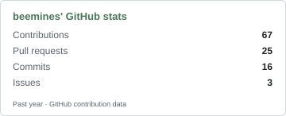
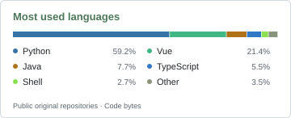
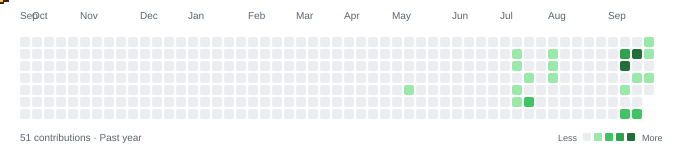

  
  
  
  
  
  
  
  

#### GitHub activity

  <picture>
    <source media="(prefers-color-scheme: dark)" srcset="./assets/stats-dark.svg" />
    
  </picture>
  <picture>
    <source media="(prefers-color-scheme: dark)" srcset="./assets/languages-dark.svg" />
    
  </picture>

#### Contribution trail

<picture>
  <source media="(prefers-color-scheme: dark)" srcset="./assets/bee-dark.svg" />
  
</picture>

#### Selected contributions

- **[nanobot #5751](https://github.com/HKUDS/nanobot/pull/5751)** · Merged  
  Preserve pending scheduled runs when editing cron tasks.
- **[AstrBot #10028](https://github.com/AstrBotDevs/AstrBot/pull/10028)** · Merged  
  Restore session model fallback for proactive tasks and background wake-ups.

Profile data refreshes every six hours. The list includes selected, merged pull requests.
